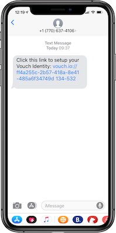
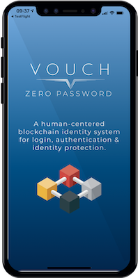
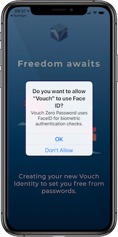
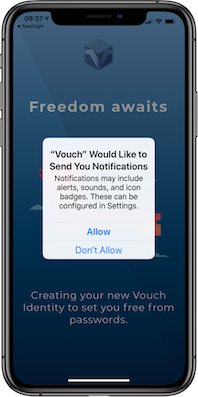
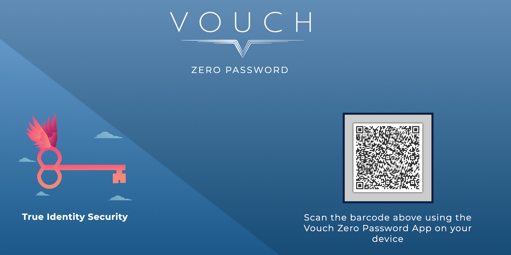
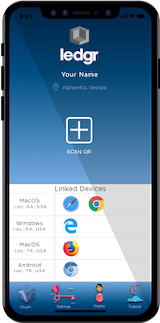
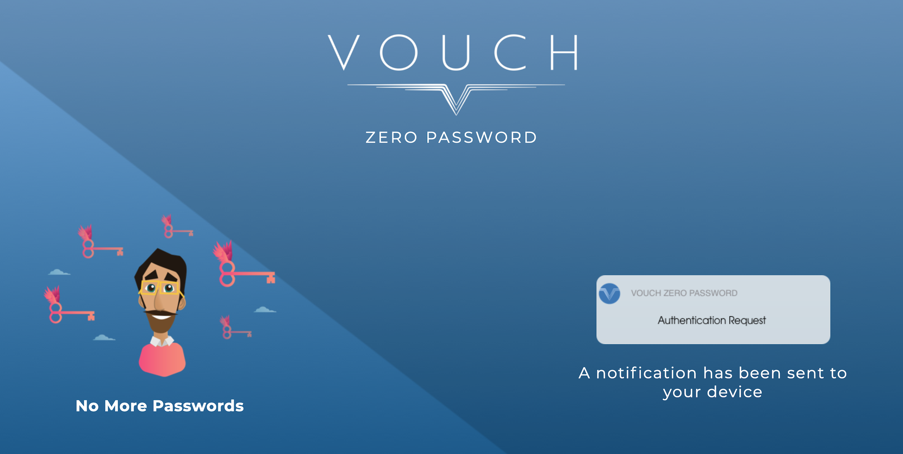

## Overview

Vouch Zero Password is a blockchain-based identity solution that completely eliminates passwords.

Vouch Zero Password utilizes a user’s smart device and biometrics to securely conduct Identity Creation, Verification, Authentication and Authorization.

Login is as simple as picking up your smart device.

There are no passwords to remember and no hardware keys required.

Vouch distributed, blockchain-based security model completely eliminates digital identity theft and reduces system vulnerabilities.

## Before you begin

In order to complete this evaluation, you will first need to contact Vouch to provision the Remote IdP side of the Federation 
and then simply download the Vouch Zero Password mobile app for the biometric enrollment and authentication. 

Please contact us at info@vouch.io to get started or for more information.

## Prerequisites

- You are familiar with ForgeRock Federation concepts and have access to the AM SAML v2.0 Guide. 
- You have engaged with Vouch, and received an email with a file named `vouch-idp-metadata.xml` as attachment

## Enable AM / Vouch Federation

This section will guide you through the steps required for configuring AM with Vouch Zero Password (VZP)
and trying it out for the first time.

### AM - Hosted SP

The following procedure provides steps for creating a hosted service provider by using the Create Hosted Service Provider wizard. 
Afterwards, you will update the Service Provider configuration with VZP settings.

#### Create a Hosted SP  

 - Under `Realms > Realm Name > Dashboard > Configure SAMLv2 Provider`, click `Create Hosted Service Provider`. 
 - `Name`: Provide your own unique identifier or leave the default suggested name (for example `VZP-CoT`)
 - Circle of Trust: Select `Add to new` option and provide a unique name to create a new Circle of Trust.
 - Attribute Mapping : leave `use default attribute mapping from Identity provider` checked for now
 - Click the `Configure` button 
 - In the follow up dialog asking to create the remote identity provider, select `No`.
 
#### Configure Hosted SP with VZP settings 

 - Navigate to `Applications -> Federation -> Entity Providers`   
 - Select the newly created hosted SP entry
 - in the `NameID Format` section, leave the default `urn:oasis:names:tc:SAML:1.1:nameid-format:unspecified`
 - in the `Authentication Context` section, set `SoftwarePKI` as the `Default Authentication Context`
 - Navigate to the `Assertion Processing` tab 
    - in the `Attribute Mapper` section, add an entry to Current Values to map the incoming `VouchIdentifier` assertion to a 
 stable identifier in the AM user data store. (eg `VouchIdentitifer=uid`) 
    - in the `Auto Federation` section, check `Enabled` and set the `Attribute` to `VouchIdentifier`
 - Navigate to the `Services` tab
    - in the `Assertion Consumer Service` section, check `HTTP-POST` and replace the the `/Consumer/` string part to `/AuthConsumer`.
 ( see `To Implement SAML v2.0 SSO in Integrated Mode` in the AM `SAML v2.0 Guide` for more info ) 

### Vouch Zero Password - Remote IDP 

In this section you will add VZP as a Remote Identity Provider and add it to newly created CoT. 
You will need the `vouch-idp-metadata.xml` file from the VZP server ( see [Prerequisites](#Prerequisites) )

#### Configure a Remote IDP

- Under `Realms > Realm Name > Dashboard > Configure SAMLv2 Provider`, click `Configure Remote Identity Provider`.
- upload the `vouch-idp-metadata.xml` file 
- in the `Circle of Trust` section, select `Existing Circle of Trust`: Select the CoT you have created as instructed 
in the [Create a Hosted SP](#create-a-hosted-sp) section.
- Click `Configure` 

### VZP Authentication chain

In this section you will create a new SAML2 authentication module and an authentication chain to redirect authentication to VZP.

#### Configure a VZP Authentication Module

- In the realm starting page of the AM admin console, navigate through `Authentication` - `Modules` and `Add a Module`
- Specify a `Name` (example `VZP`), select `SAML2` as `Type` and click `Create`
- Configure the SAML2 authentication module options:
    - Set `IdP Entity ID` to the value defined by the `entityID` attribute in the `vouch-idp-metadata.xml` file. 
    - Set `SP MetaAlias` to the MetaAlias of your previously created hosted SP (eg `/sp`)
    - Set `Request Binding` to `HTTP-Redirect`.
    - Set `Response Binding` to `HTTP-POST`
    - Set `NameID Format` to `urn:oasis:names:tc:SAML:1.1:nameid-format:unspecified`

#### Configure a VZP Authentication Chain

- Navigate to `Realms > Realm Name > Authentication > Chains`, click `Add Chain`
- Specify a `Name` (example `VZPChain`) and click `Create`
- Click `Add Module`
- In the New Module dialog:
    - Under `Select Module`, select the module created above (eg `VZP`)
    - Under `Select Criteria`, select `Required`
- Click `OK`and then `Save Changes`

## Test AM-VZP configuration

In this section you will test your configuration by logging in to the AM console as a user to view that user’s profile. 
You will be redirected to the VZP IdP for a passwordless authentication using your mobile device and your biometrics.

### Install VZP Mobile and on-board 

- Download the VZP mobile app from the Apple or Google Play App Store
- Open the invitation sms sent by your Vouch contact, and click the link  

- This opens the app, the user will then allow any requested permissions  

**Note:** The flow above demonstrates a default onboarding process of the first user via an sms invitation. 
Many other mechanisms including email and in-person endorsements are supported as well, please contact Vouch for more info. 

### Perform passwordless login

- Clear your browser's cache and cookies.
- Login into the user’s profile using a URL that references the authentication chain with SAML2 module that you created above. 
For example, http://openam.partner.com:8080/openam/XUI/#login/&service=VZPChain
- If configured correctly, AM will redirect you to the VZP identity provider for authentication. You will be presented with a page similar to the below:  

- In the VZP app tap `SCAN QR`  
 
- Scan the QR code and then present your biometrics
- AM should now give you access to the user’s profile page.

**Note**: The QR code is only used initially to bind the browser to the mobile device, 
subsequent logins will send out a push notification, reducing user friction while preserving strong security.

   

## What’s Next?
For assistance or more information, please contact us at info@vouch.io

